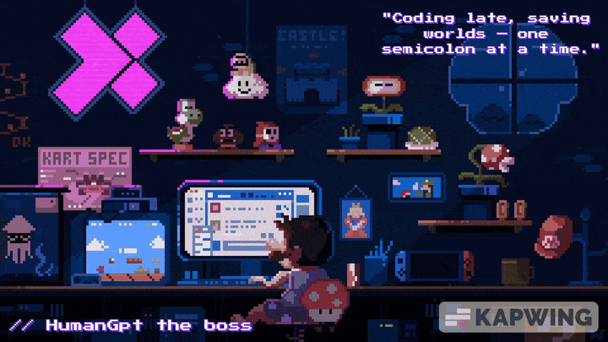
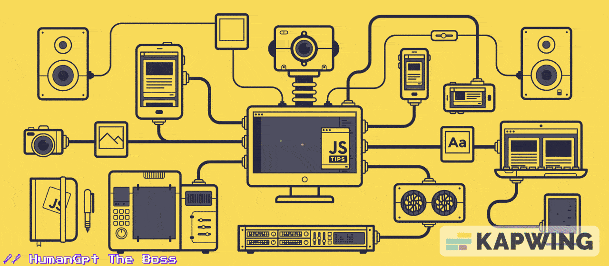

<!-- MasterHead -->

<!-- Greeting -->

<h1 align="center">Namaste 🙏 I'm HumanGpt</h1>

<h4 align="left">
  🌟 I'm a self-taught developer exploring both frontend and backend development.  
  Currently diving deep into Laravel, PHP, React, Next.js, and TypeScript.  
  My journey is fueled by curiosity, late-night code sessions, and a drive to master the full stack.
</h4>

 

  <!-- Profile Views -->
  

  <!-- Total Stars -->
  

  <!-- Followers -->
  

    
<!--👀VIEWS / 🌐WEBSITE: https://github.com/antonkomarev/github-profile-views-counter -->

<!-- about me -->
 <h3 align="left">💫 About Me</h3>

<!--
  

-->
<h4> 
  🌱 I’m currently focused on sharpening my skills in both frontend and backend development. 
  🔭 I've worked with the .NET Framework and have hands-on experience with the MVC architecture. 
  💬 I’m proficient in programming languages like Javascript and SQL, and I'm exploring PHP (Laravel), React, and TypeScript. 
  ⚡ I’m deeply interested in Artificial Intelligence, Machine Learning, Data Science, Automation, and Blockchain development. 
  ✨ I have a strong eye for detail — I believe in crafting clean, purposeful, and impactful code.</h4>
 
 

  <h3>🧲 Connect me :</h3>
 
  
  <!-- 
      updating soon....
   
    
  

 -->

  
  <!--
-->

</h4>

 

<!--Experence and experencing
<h3 align="center">🔆 Work'ed and Wor'king</h3>

    
    

-->

<!-- git stat-->
<h3 align="center">🌱 Github Status</h3>
 

  
  
  
<!-- Proudly created with GPRM ( https://gprm.itsvg.in ) -->
  

  

<!-- lang-->
<h3 align="center">📚 Languages & tools I Have placed My Hands On </h3>

 

   
     
     
     

 

<!-- top repo and teck stack

  <h3>⭐️ Best Repositories</h3>
  

    
    

 -->

  
  <h3>💻 Tech Stack:</h3>
      
  

  <!-- Fixed & Corrected Shields.io Badges -->
  
  
  
  
  
  
  
  

  
 
  

<!--<h3>⭐ Top Contributed Repo!</h3>
        
      
       -->

<!-- ending-->

⚠️ This README is uniquely designed by <strong>HumanGpt</strong>.

