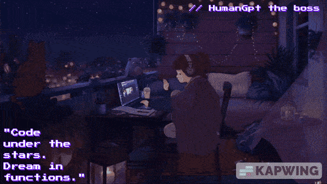

# 👾 HumanGPT — Code Alchemist of the Night

<!-- Mario Cool Coder Coding at Night -->

  

<!-- JavaScript Powered Factory GIF -->

  

<!-- GitHub Cat -->

  

<!-- Girl Coding Outside at Night -->

  

---

### ⚡ Nerd Quotables

> 🎮 *"Saving the world, one semicolon at a time."*  
> ⚙️ *"Powered by logic. Fueled by JavaScript."*  
> 🐱 *"Pushing pixels, pulling greatness."*  
> 🌙 *"While the world sleeps, we create."*

---

### 🧠 Who Am I?

I’m **HumanGPT**, a code ninja who turns caffeine and midnight into full-stack magic.  
Crafting tools, building dreams, and breaking bugs — one commit at a time.

---

### 🛠️ My Arsenal

- ⚡ JavaScript, TypeScript
- 🧱 React, Tailwind, Node.js
- 🛡️ Validation Engines (Joi, Ramda, Custom Logic)
- 📂 Dev Arsenal (Custom Library)
- 🧠 Learning Laravel, PHP, and beyond...

---

### 🔗 Connect

- 🌐 [My Dev Arsenal](https://github.com/HumanGp/DevArsenal_.git)
- 🧪 In the lab, brewing Kaidora (AI Assistant)

---

### 🖋 Watermark

  <strong>HumanGPT — The Boss</strong>

